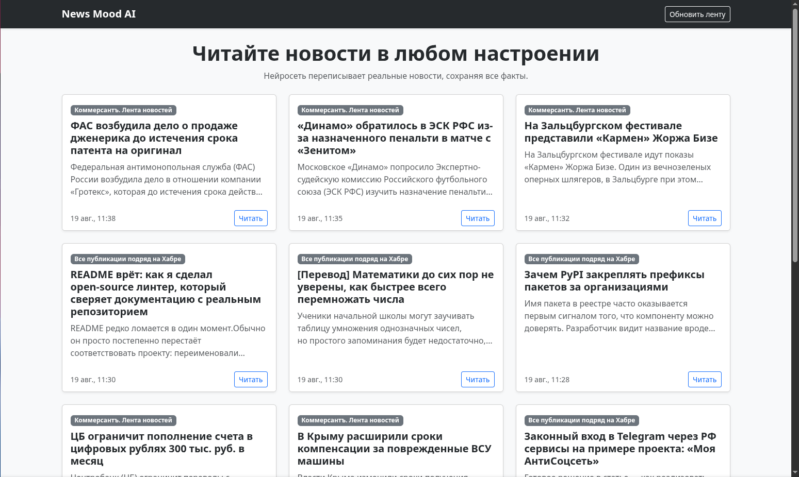
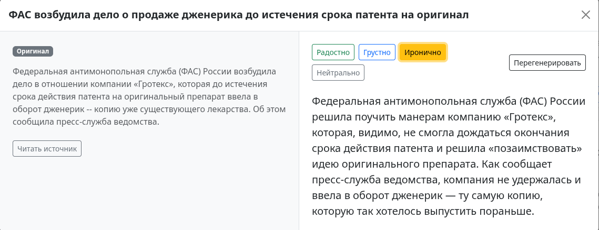

# News Mood AI

Веб-приложение, позволяющее читать реальные новости в различных эмоциональных стилях (радостно, грустно, иронично, нейтрально) с помощью генеративного ИИ и **гарантированным сохранением исходных фактов**.

---

## Как запустить проект

### 1. Требования
* Docker и Docker Compose

### 2. Запуск через Docker (быстрый старт)
1. Клонируйте репозиторий:
   ```bash
   git clone <ссылка_на_ваш_репозиторий>
   cd <папка_проекта>
   ```
2. Создайте файл конфигурации `.env` на основе примера:
   ```bash
   cp .env.example .env
   ```
3. Заполните переменные в `.env` (при необходимости укажите ваш API-ключ от OpenRouter/Groq/OpenAI):
   ```env
   AI_API_KEY=ваш_ключ
   AI_BASE_URL=https://openrouter.ai/api/v1
   AI_MODEL_NAME=openrouter/free
   ```
4. Запустите проект одной командой:
   ```bash
   docker compose up -d --build
   ```
5. Откройте в браузере: **`http://localhost:8000`**
*(Swagger UI доступен по адресу: `http://localhost:8000/docs`)*

---

## Архитектура и технологии

* **Backend:** Python 3.11, FastAPI (асинхронный фреймворк, высокая производительность).
* **Database & ORM:** PostgreSQL 16 + SQLAlchemy (декларативные модели).
* **AI Integration:** OpenAI Python SDK (совместим с любыми провайдерами: Groq, OpenRouter, OpenAI, Z.ai).
* **Frontend:** HTML5, Bootstrap 5, Vanilla JS (асинхронное SPA-взаимодействие через Fetch API).
* **Data Ingestion:** RSS-парсер на базе `feedparser` с санитизацией HTML-тегов.
* **DevOps:** Docker, Docker Compose, Healthcheck для безопасного старта сервисов.

---

## 1. Откуда берутся новости
Новости собираются из открытых и авторитетных RSS-лент (Коммерсантъ, Хабр, 3DNews). 
* При старте приложения и по нажатию кнопки **«Обновить ленту»** скрипт парсит ленты, очищает контент от разметки (рекламных тегов, ссылок на изображения) и сохраняет чистый текст в таблицу `news`.
* Дублирование исключено на уровне уникальных ссылок (`source_url`).

---

## 2. Как устроено хранение данных и кэширование
Используется реляционная схема базы данных:
* `news` — оригинальные публикации (заголовок, чистый текст, источник, дата публикации).
* `rewritten_news` — кэш сгенерированных текстов под конкретные стили (`news_id`, `mood`, `rewritten_text`). Наложен `UniqueConstraint(news_id, mood)`.

**Паттерн ленивой генерации (Lazy Loading / Memoization):**
При запросе определенного настроения сервер сначала проверяет БД. Если текст уже был сгенерирован ранее — он отдается за **1-2 мс** без расхода токенов и задержек сети. 
Если пользователь хочет получить другой вариант, кнопка **«Перегенерировать»** принудительно вызывает ИИ (`force_update=True`) и обновляет запись в БД.

---

## 3. Как переписывается тон и контролируются факты (AI / Prompt Engineering)

Для выполнения задачи использованы методы строгого промптинга:

### А. Системный промпт (System Prompt)
В системную инструкцию заложены строгие негативные ограничения:
```text
Ты — профессиональный ИИ-редактор новостей. Твоя задача — изменить эмоциональный тон текста согласно инструкции.
ЖЕСТКИЕ ПРАВИЛА:
1. Категорически запрещено изменять, искажать или выдумывать факты: имена, фамилии, даты, числа, статистику, цены, географические названия и цитаты.
2. Сохраняй суть и события новости.
3. Выдай ТОЛЬКО переписанный текст, без вводных слов, пояснений и комментариев от себя.
```

### Б. Детерминированность генерации (Параметры LLM)
* Установлен параметр **`temperature = 0.3`**. Низкая температура уменьшает стохастичность (галлюцинации) модели и заставляет её строго придерживаться фактов из контекста, меняя только эмоциональный окрас лексики и синтаксиса.
* Поддерживаются продвинутые модели: `Llama 3.3 70B`, `Gemini Flash`, `DeepSeek R1` через шлюз OpenRouter.

---

## Скриншоты интерфейса

### Главный экран


### Сравнение оригинала и текста от нейросети

